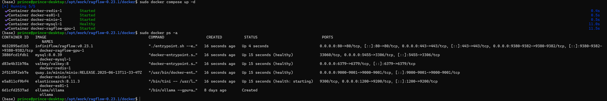
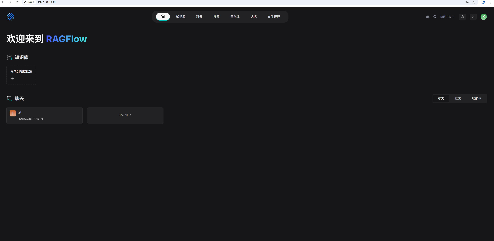

# RAGFlow 0.23.1 快速部署

## I 环境
####  windows 11： 不推荐（即使WSL2 Ubuntu也不方便）
#### Ubuntu ：推荐。快速部署推荐docker compose方式

## II 安装步骤

#### 1 参考官网
1 推荐Docker Compose部署后，远程开发。
  cd 到 项目根目录/docker下面，执行docker compose -f docker-compose.yml up -d,等待完成（可能要很久，取决于网络链接镜像是否靠谱，靠谱的话一会儿就行）。
  2 等待执行完成（每个项目左边都打对号），访问 http://localhost 即可
  如果不知道端口，执行 sudo docker ps -a，出现类似下图，查找访问端口（这里是默认80）

 如果要使用gpu，则先于docker compose 执行 sed -i '1i DEVICE=gpu' .env
## 附图：
访问 http://localhost （示例图片是远程主机）

