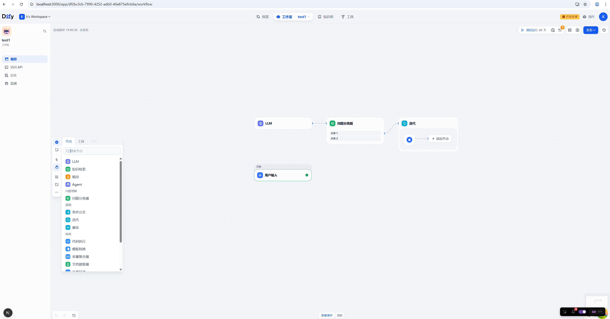

# Dify 1.11.2 快速Windows本地部署

## I 环境
####  windows 11
#### PyCharm+Miniconda+Python3.13+Node 24+npm 11+pnpm 10+uv+PostGre（推荐17以下，18要改代码）+Redis(win版本)
#### 注意：
1 这个版本的dify插件需要单独暗装使用dify-plugin-daemon服务（https://github.com/langgenius/dify-plugin-daemon），
 需要安装Go语言（https://go.dev/dl/go1.25.5.windows-amd64.msi） 。否则Dify启动过后，会不停报错（插件服务找不到）,官方称未适配windows，但是试了一下，可以run起来。
 2 因软件兼容性问题，虽然可以安装，但无法排除存在功能特性不可用或者相关bug，仍建议Linux部署。
## II 安装步骤

#### 1 安装工具
自行安装，基础难度。
 包含PyCharm+Miniconda+Node 24+PostGre（推荐17以下，18要改代码）+Redis(win版本)
 Miniconda https://repo.anaconda.com/miniconda/Miniconda3-latest-Windows-x86_64.exe
 Nodejs https://nodejs.org/dist/v24.12.0/node-v24.12.0-x64.msi
 PostGre 18  https://sbp.enterprisedb.com/getfile.jsp?fileid=1259914
 Redis(老的win版本，理论新的更好)https://github.com/microsoftarchive/redis/releases/download/win-3.0.504/Redis-x64-3.0.504.msi

#### 2 部署后端
###### 1 部署api。首先用conda创建并激活虚拟环境，然后参考项目目录api/README.md，除了docker那一步，其它类似。但需要参考以下几点问题点
问题1：生成SECRET_KEY那一步，在PS粘贴 openssl rand -base64 42，将回车后生成的那串字符贴到.env里面SECRET_KEY=后面即可（Windows应该不支持 sed命令）。
 问题2：安装uv后，执行uv时，可能会报“找不到命令。。。”错误，解决方法时找到uv.exe的全路径，用全路径执行命令或者添加到环境Path。
 问题3：执行 uv run flask db upgrade 前，确保PG数据库服务正常，且里面有.env文件里DB_DATABASE=后面的名字的数据库已经创建，且配置正确。否则会报数据库错误。
 问题4：如果PG数据库是18版本，执行 uv run flask db upgrade 前，去搜索 "CREATE FUNCTION uuidv7()",将这段函数创建代码注释掉，否则会报错“函数名称歧义。。”类似错误，因18版本PG有同名函数。
 问题5：注意修改Redis密码，或者简单配置空；
 问题6：如果报错“REDIS SERIALIZATION PROTOCOL。。”类似redis协议错误，根据分析源码，配置文件加入REDIS_SERIALIZATION_PROTOCOL=2，比如用本文redis下载地址那个

###### 2 部署dify-plugin-daemon服务。参考源码目录下README.md和CLAUDE.md，根据后者做如下几个步骤。
（1）修改配置文件，主要是数据库那里，需要现在PG中创建名为 DB_DATABASE=后面的值的数据库
 （2）（建议）修改配置文件，Redis数据库那里，REDIS_DB这个值，视你的Redis修改，尽量不要和api/.env后端服务CELERY_BROKER_URL和REDIS_DB的相同
 （3）（建议）建议修改go代理，执行 $env:GOPROXY = "https://goproxy.cn,direct" 。即使能科学上网，这个也不太稳定。
 （4）最后一步，执行 go run cmd/server/main.go  等待。在任务管理器可以搜到一个go.exe的后台任务。

#### 3 部署前端
###### 1 参考web/README.md即可。但注意以下几点
问题1：安装pnpm时，使用官网（https://pnpm.io/installation） 推荐的方法可能报错，而且根据报错信息难以找到有效方法解决，反而直接使用以下命令简单有效。
   Invoke-WebRequest https://get.pnpm.io/install.ps1 -UseBasicParsing | Invoke-Expression

#### 4 体验
以上全部完成后，浏览器访问 http://localhost:3000/ ，根据提示设置管理员账号密码，就可以进去了。
 除了知识库需要上传资料，先看下其它几个界面

 附加一张

