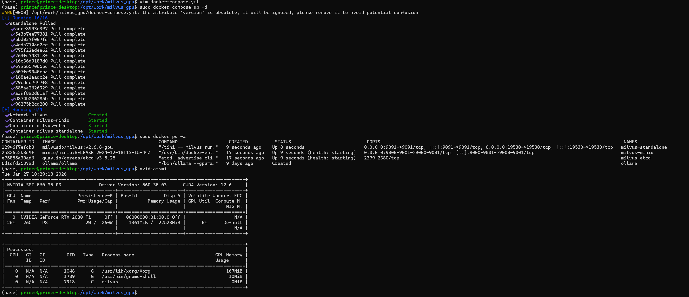
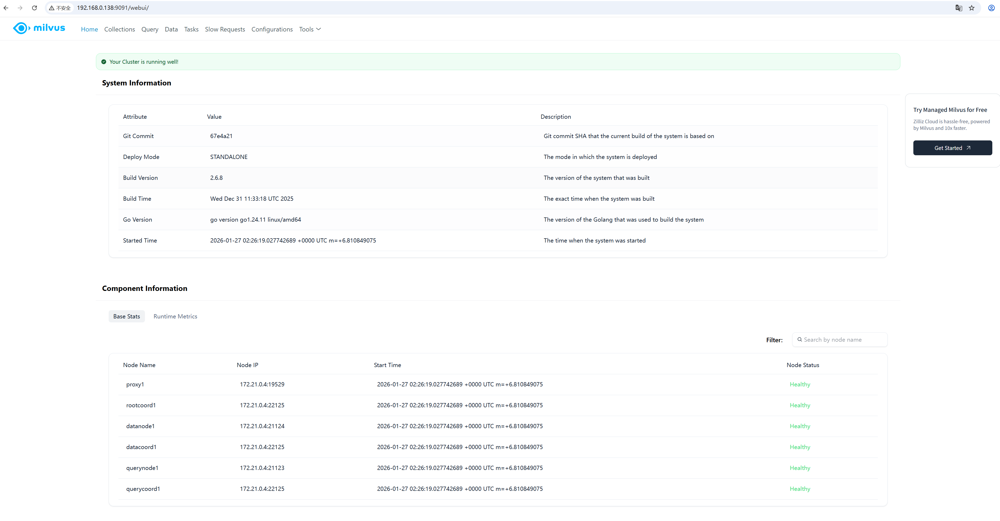
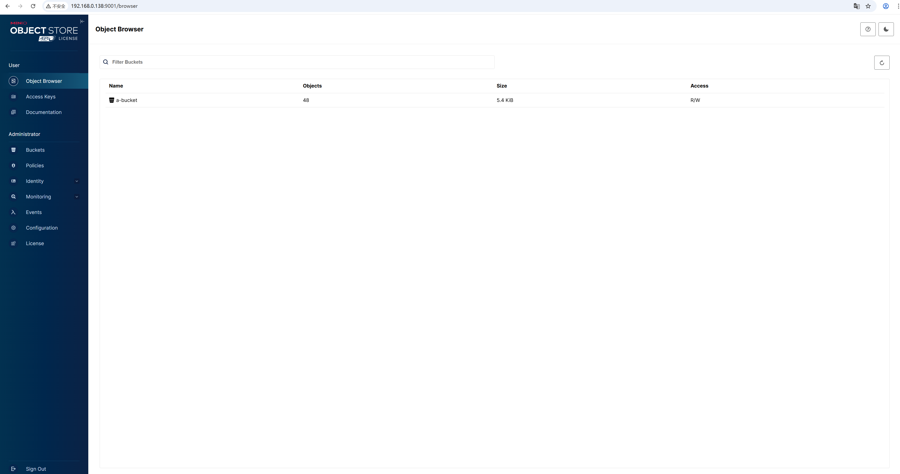

# Milvus 2.6.x 快速部署

## I 环境
####  windows 11： 不推荐（即使WSL2 Ubuntu也不方便）。安装Lite版本后出现过“找不到milvus。。”的报错信息。
#### Ubuntu ：推荐。快速部署推荐docker compose方式

## II 安装步骤

#### 1 参考官网 https://milvus.io/docs/zh/install_standalone-docker-compose.md
  1 推荐Docker Compose部署后，远程开发。
  执行
  
wget https://github.com/milvus-io/milvus/releases/download/v2.6.9/milvus-standalone-docker-compose.yml -O docker-compose.yml
  完成后执行
  
sudo docker compose up -d,等待完成（可能要很久，取决于网络链接镜像是否靠谱，靠谱的话一会儿就行）。
  2 等待执行完成，访问 http://localhost:9091/webui/ 即可（管理工具UI）。另外通过9000或9001访问minio
  如果需要GPU版本，则(参考 https://milvus.io/docs/zh/install_standalone-docker-compose-gpu.md )
  
wget https://github.com/milvus-io/milvus/releases/download/v2.6.9/milvus-standalone-docker-compose-gpu.yml -O docker-compose.yml
   参考官网，修改配置文件中的  deploy.resources.reservations.devices[0].devices_ids: ['0', '1'] 实现指定使用哪些gpu。

## 附图：
访问 http://localhost:9091/webui/ （示例图片是远程主机）

访问 http://localhost:9000 （示例图片是远程主机，账号密码在配置文件中可查看，这里均为minioadmin）
