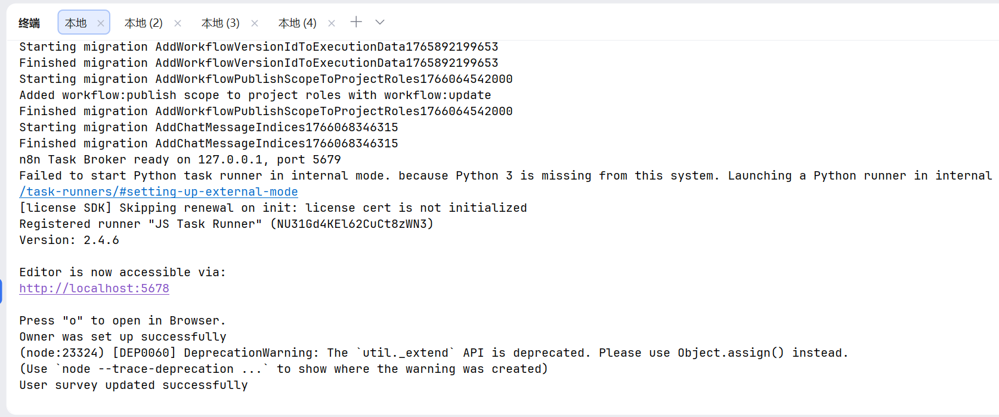
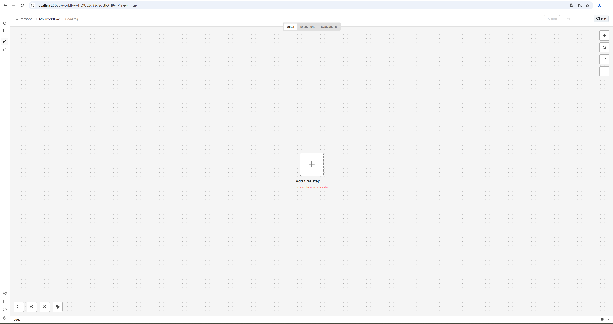

# n8n 2.2.6 快速Windows本地部署

## I 环境
####  windows 11
#### Node 24+Python 3（可选）

## II 安装步骤

#### 1 安装工具
自行安装，基础难度。
 Nodejs https://nodejs.org/dist/v24.12.0/node-v24.12.0-x64.msi

#### 2 部署
###### 1 参考 https://docs.n8n.io/hosting/installation/npm/ 即可。在项目根目录执行以下命令即可（一定要注意保持“网络良好”）
   npx n8n

完成后类似下图，访问 http://localhost:5678 即可

如果在Ubuntu出现“安全cookie。。”导致无法访问，再执行npx n8n前，可通过执行以下命令临时禁用该安全提示
 
export N8N_SECURE_COOKIE=false

## 附图：
访问 http://localhost:5678 

