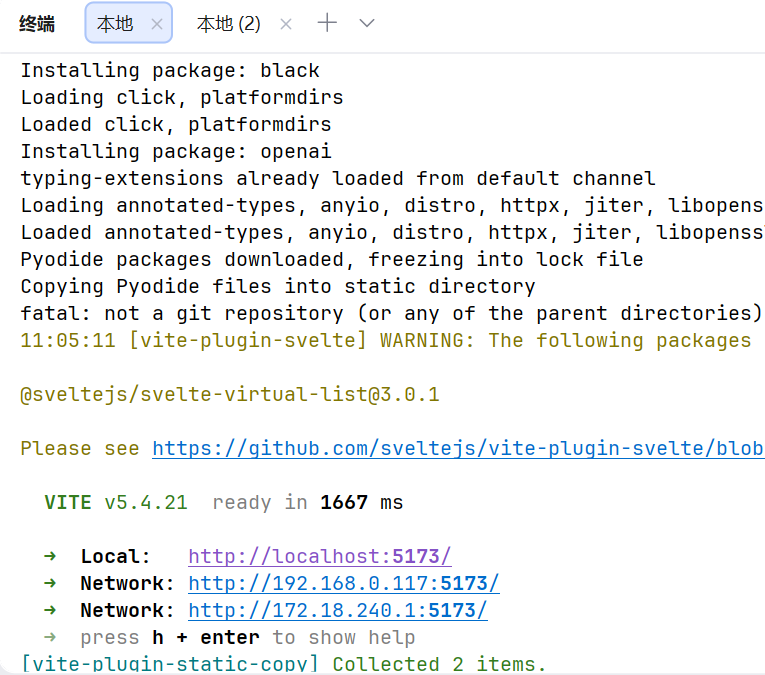
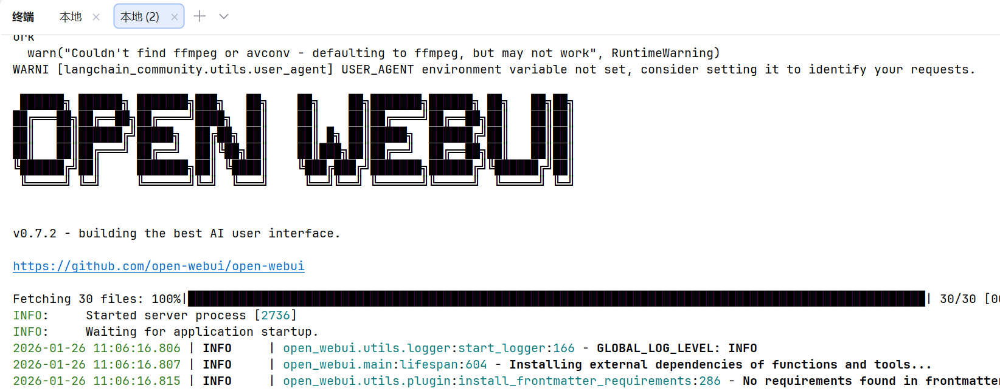
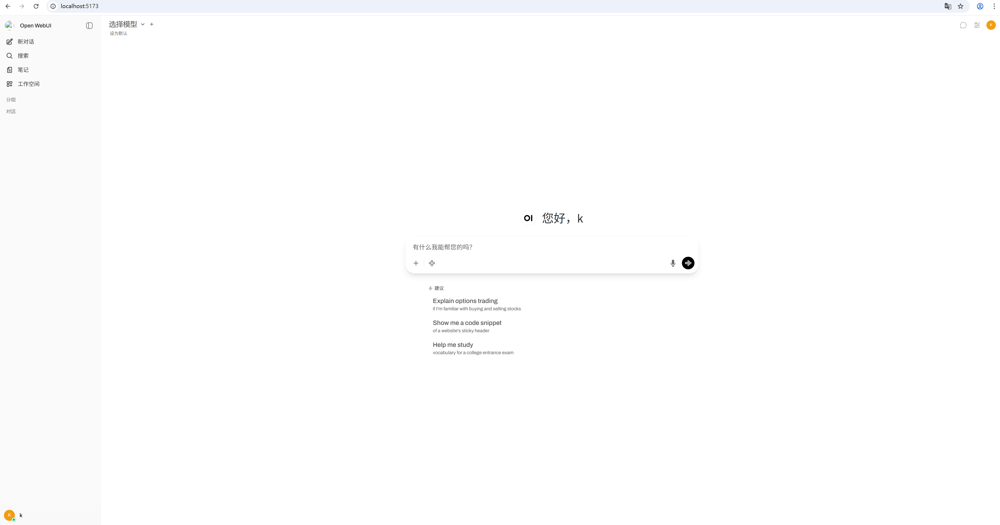

# open-webui 0.7.2 快速Windows本地部署

## I 环境
####  windows 11+ python3.11

## II 安装步骤
###### 注意：一定要保证“网络畅通”，首次启动时，它可能会长时间没有任何提示或日志输出在干什么，即使有错误信息也可能误导你（搜不到准确结果的。。） （猜测：启动过程中可能会下载大文件，但无有效提示）
#### 1 本地快速安装，参考Git官方
  创建python3.11的环境，激活，执行pip install open-webui 安装，执行open-webui serve启动, http://localhost:8080 访问

#### 2 本地开发方式
###### 1 参考 https://docs.openwebui.com/getting-started/advanced-topics/development/ 即可。
唯一区别是在windows上将执行dev.sh换成执行 start_windows.bat
###### 2 完成后前端和后端分别类似下两图，访问 http://localhost:5173 即可

## 附图：
界面。安装使用ollama下载启动模型后，“选择模型”下拉列表会有模型，选择后，就可以问它问题了。 注意：如果没有ollama模型服务，后端控制台可能看到类似“连接失败。。。”的错误信息

